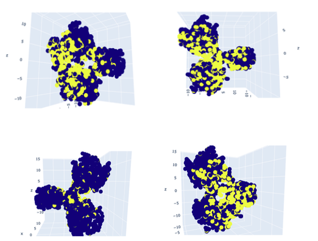

# Loan Default Prediction – Feature Engineering & EDA

## Introduction
This project focuses on preparing a raw financial dataset for machine learning by applying various feature engineering techniques. The aim is to transform raw data into a structured format suitable for predictive modeling.

---

## Task 1: Exploratory Data Analysis (EDA)

At the initial stage, the dataset was explored to identify:
- Numerical variables  
- Categorical variables  

### Key Insights:
- Heatmaps were used to visualize missing values.
- Histograms helped identify skewness and distribution.
- Categorical features such as **employment type**, **education level**, and **region** showed similar default rates across categories, indicating limited individual impact on the target variable.

---

## Task 2: Data Cleaning

Different imputation techniques were applied:

- **Age** → Mean imputation (no major variation between defaulters and non-defaulters)
- **Credit Score** → Imputed based on default status (reflecting real-world behavior)
- **Employment Type** → Filled using proportional distribution from existing data

### Outliers:
- Not removed, as they represent genuine financial variations.

---

## Task 3: Feature Transformation & Encoding

### Transformations:
- **Log Transformation** → Reduced skewness in income and spending
- **Robust Scaling** → Applied to handle outliers
- **Binning (Experience)** → Reduced noise in data

### Encoding:
- **Ordinal Encoding** → For features with natural order
- **One-Hot Encoding** → For nominal variables (e.g., region, employment type)

> This prevents unintended ranking in categorical features.

---

## Task 4: Feature Construction

New features were created to better represent financial behavior:

1. **EMI/NMI Ratio** → Indicates repayment burden  
2. **Difference between Loan Amount & Financial Buffer** → Shows financial safety  
3. Combined feature of **credit score, financial capacity, and loan amount** → Strong correlation with default  

---

## Task 5 & 6: Feature Selection & Multicollinearity

### Feature Selection Methods:
- Mutual Information  
- Pearson Correlation  
- Spearman Correlation  

### Multicollinearity Check:
- Variance Inflation Factor (VIF)

> Redundant features were removed to improve model performance and stability.

---

## Task 7: Dimensionality Reduction

Two techniques were applied:

- **PCA (Principal Component Analysis)** → Preserves overall variance  
- **t-SNE (t-distributed Stochastic Neighbor Embedding)** → Preserves local structure  

### Observations:
- Dataset showed limited variation  
- t-SNE helped visualize partial clustering  
- Clear clusters were not strongly formed, but some separation was observed  

---

## Tech Stack
- Python  
- Pandas  
- NumPy  
- Matplotlib  
- Seaborn  
- Scikit-learn  

---

## Conclusion
This project highlights the importance of proper data preprocessing and feature engineering in machine learning. Even when patterns are not immediately visible, transformations and feature construction help uncover meaningful insights.

---

## Author
**Name:** Rageshwer Singh   
